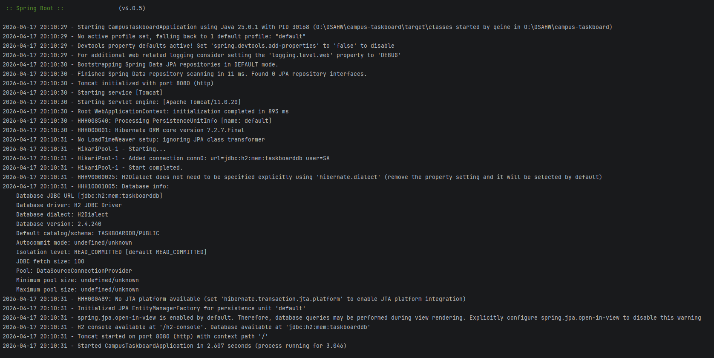
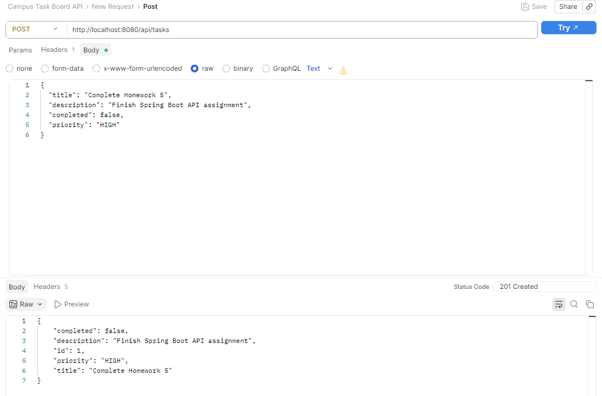
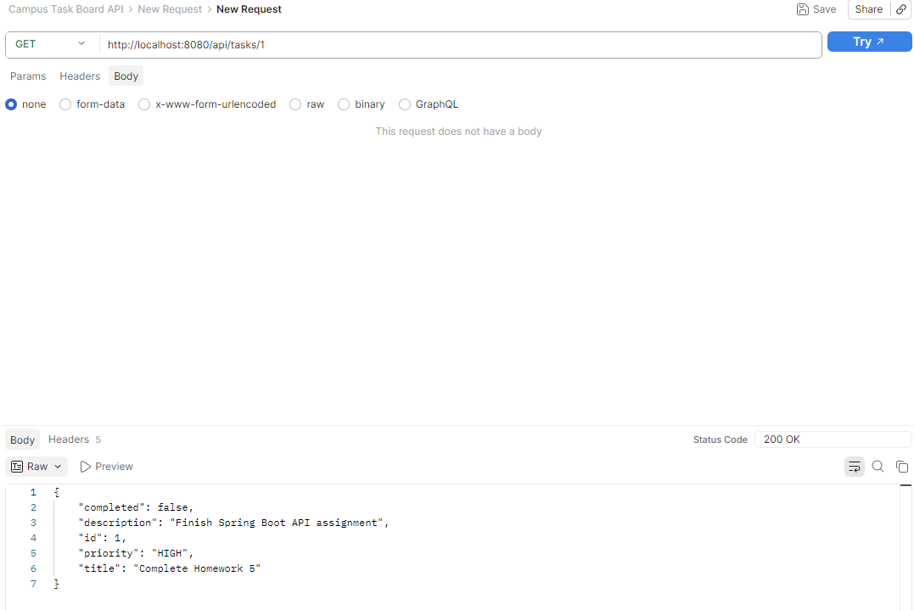
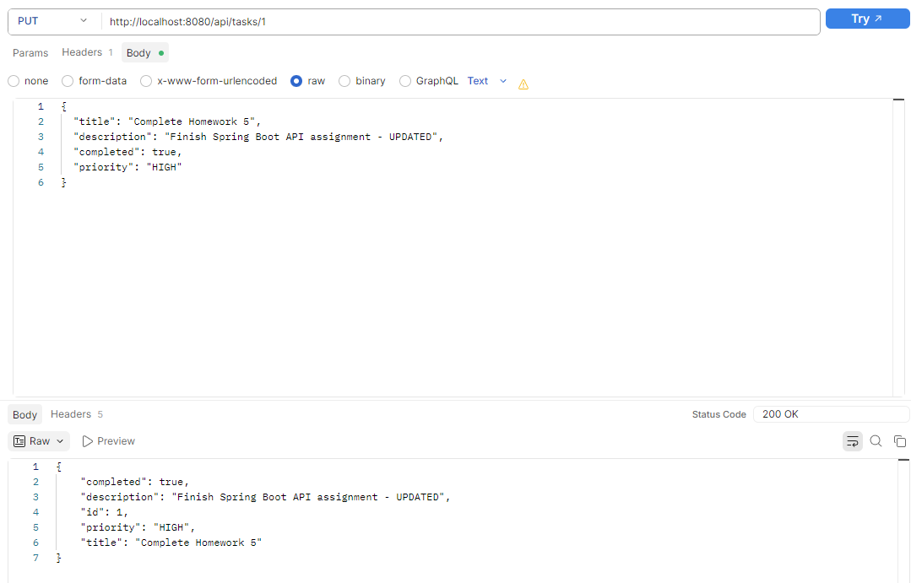
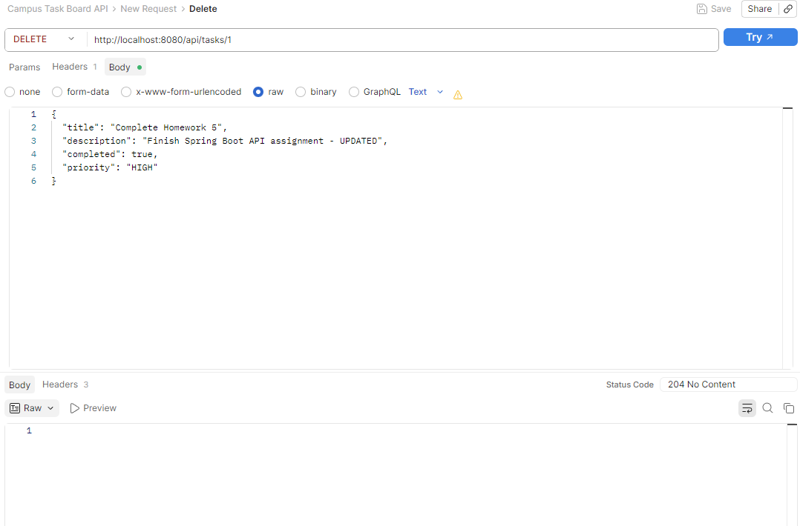
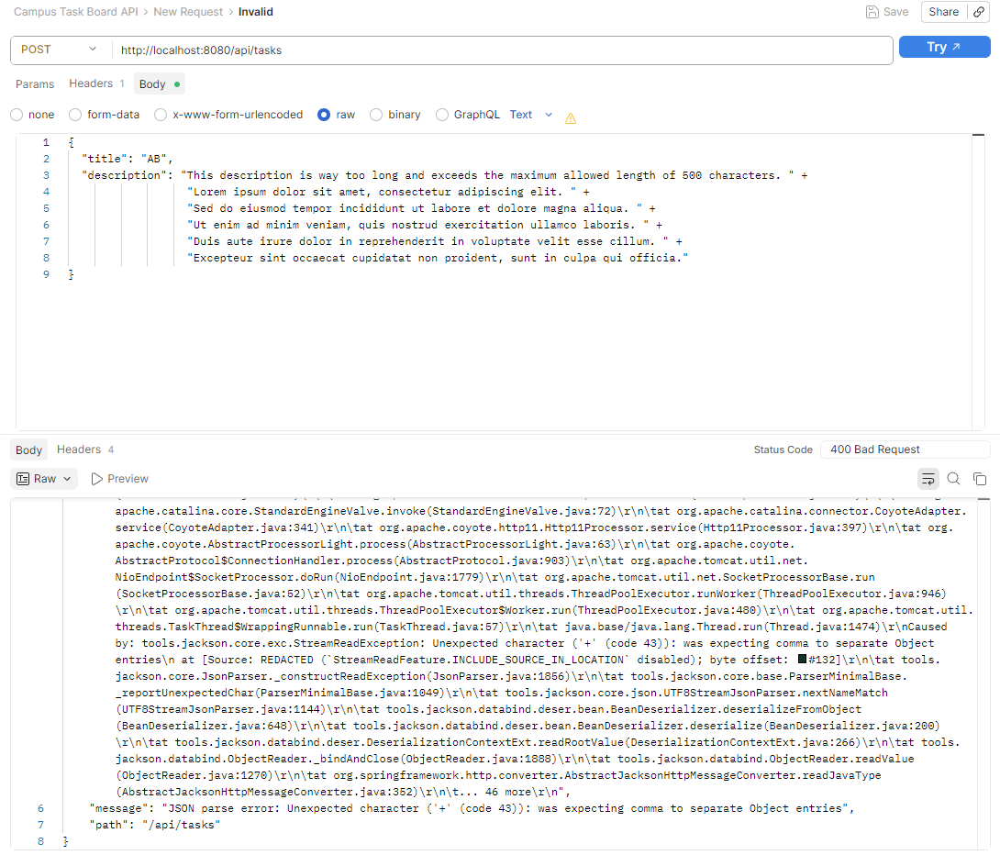
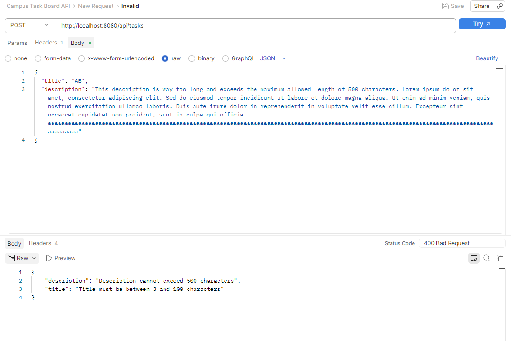
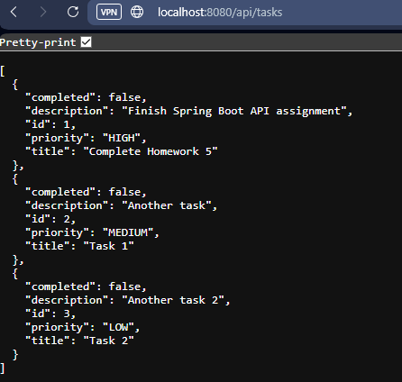

This program creates a REST API with HTTP. There is a controller that allows for requests to be made on the website.
Tasks will be created with a title, description, and priority level. ID numbers will be autogenerated and used to find the task.  

On postman, there are POST, GET, PUT, and DELETE methods that correspond with methods in TaskController.  
POST creates a task.   

GET retrieves a task.  

PUT updates a task.  

DELETE removes a task.  

There are validations errors to make sure that the posted task fits in size for title and description.
First is an attempt with the code given in the GitHub but it did not give the wanted output.  

I removed all the '+' and made the text longer so it gives the correct error.  

Multiple tasks on the website  

Video Link: https://youtu.be/547WHEsBrkM
